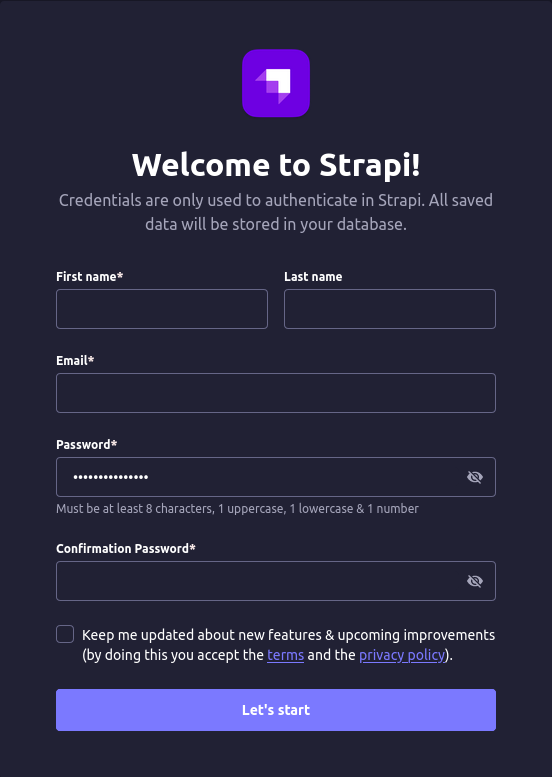
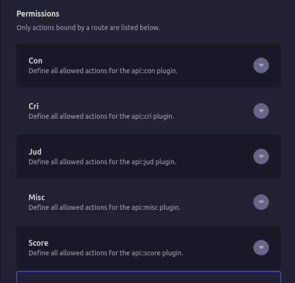

<p align="center">
  
</p>

<h3 align="center">A tallying system for beauty pageants or other similar contests.</h3>
<p align="center">For when you have to keep track of 3 entities: Contentants, Judges, and Criteria; at the same time keep Score and Rank them.</p>

## Deployment

The recommended way to launch the App is via **Docker** and **docker-compose** (you can ofcourse build from source if you're planning to customize) so you'll have to install those dependencies first.

Assuming you have Docker and docker-compose installed, lets start with making a directory for the app

```bash
mkdir crown
```

Inside the created directory create a `docker-compose.yml` file.

See `docker-compose.yml` file example below.

```yml
version: "3"
services:
  next:
    image: gregbasera/crown:2.0
    environment:
      # the server's IP; can't be localhost; example:
      # - NEXT_PUBLIC_SERVER_HOST=0.0.0.0
      - NEXT_PUBLIC_SERVER_HOST=<put-server-IP-here>
    ports:
      - "3000:3000"
    depends_on:
      - "data"

  data:
    # image: gregbasera/crowndb:strapi4.1.8
    image: gregbasera/crowndb:sm
    volumes:
      - ./database:/usr/src/app/.tmp
    ports:
      - "1337:1337"
```

Run the compose file with the command below. This will pull app images from DockerHub and run it.

```bash
docker compose up -d
```

The app should be running now, but before you can use it you'll need to configure the backend a bit (Strapi's _roles_ and _permissions_).

First create an administrator for the database. Go to [localhost](http://localhost:1337/admin)

<p align="center">
  
</p>

Proceed to _Settings > Users & Permissions plugin > Roles > Public_

Tick/Allow all permissions for **Con**, **Cri**, **Jud**, **Score**, and **Misc**.

**Save** it.

<p align="center">
  
</p>

If everything goes well, you should be able to go to [localhost](http://localhost:3000/) and login.

At first init you should be able to just click on _Proceed_ and reach the server UI. From there you can set necessary settings you'll need for the app.

- Server is on _http://SERVER-IP-HERE:3000/server_
- Client is on _http://SERVER-IP-HERE:3000/client_
- Strapi is on _http://SERVER-IP-HERE:1337/admin_

## Limitations

- This project is not meant to be scaled. UI/UX will not support it. (Exceed the recommended settings at your own risk)
  - Recommended:
    - less than 40 Contestants
    - less than 10 Judges
    - less than 7 Criteria
  - Work-arounds:
    - you can full-screen the browser with F11
    - you can zoom-out the browser and sacrifice readability
      - Firefox and Chrome can zoom-out down to 30% and 25% respectively with Ctrl-Scroll-down
    - you can use a bigger monitor, a wide-screen TV or even a projector and scale it better.
- Judges can only score in the scale of 1-10; 1 the lowest, 10 the highest; decimal notation not allowed.
- Computations are done using a _rank-based_ system. [Learn more](#computations).
- _Coronation_ (if enabled) will not take into account scores from any _Criteria_. [Learn more](#final-segment).

### Questions and Feedback

_basera.gg@gmail.com_
